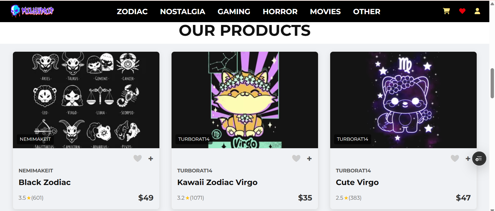

# 🌌 MilkyDrip
A modern and stylish **Design Website** where users can explore, customize, and order designs on various products.  
Built with **React, Vite, and Tailwind CSS** and deployed seamlessly with **Vercel**.  

---

## ✨ Features
👕 Browse customizable clothing & products  
🎨 Upload your own artwork or choose from templates  
🖼️ Live product preview before checkout  
🛒 Add to Cart & smooth Checkout flow  
📱 Fully responsive design with Tailwind  
⚡ Fast & optimized performance with Vite  
🚀 Deployed on Vercel for instant access  

---

## 🚀 Live Demo
👉 [View MilkyDrip on Vercel](https://milky-drip.vercel.app/)  

---

## 🛠️ Tech Stack
⚛️ **React** (Hooks, Components, State Management)  
⚡ **Vite** (for blazing-fast bundling & dev server)  
🎨 **Tailwind CSS** (for modern, responsive UI)  
▲ **Vercel** (for deployment & hosting)  

---

## 📸 Screenshots
🖼️ **Home Page**  

!

🛒 **Product Customization**  


---

## ⚡ Getting Started

### 1️⃣ Clone the Repository
```bash
git clone https://github.com/your-username/MilkyDrip.git
cd MilkyDrip
npm install
npm i react-router-dom
npm install tailwindcss @tailwindcss/vite
npm run dev

